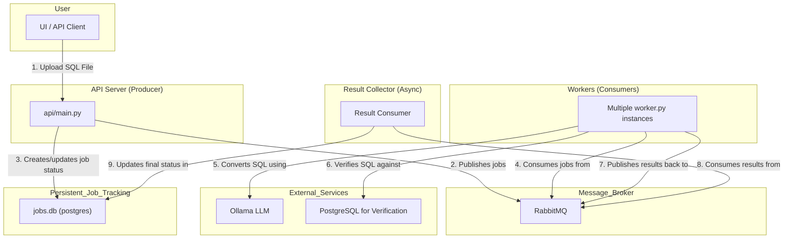

## AI powered project to convert SQL to PostgreSQL syntax (Expertimental)


---


----

This project provides a web-based UI and an API to convert Oracle stored procedures, functions and DDL's to PostgreSQL PL/pgSQL syntax using a local Ollama model.





## Project Scripts

### `gini.sh`

This is the main script to set up and run the entire application. It automates the following steps:

1.  **Cleanup**: Removes artifacts from previous runs, such as `converted-*`, `failed-*`, `jobs.db`, and `successful-*` files.
2.  **Dependency Check**: Verifies that `uv`, `docker`, and `ollama` are installed.
3.  **Ollama Model Check**: Ensures that an Ollama model is running and accessible.
4.  **Python Environment Setup**: Creates a virtual environment (if it doesn't exist) and installs all required Python packages using `uv`.
5.  **Dockerized Services**:
    *   Starts a **RabbitMQ** container for messaging.
    *   Starts an **Oracle Database** container and initializes it with a user and grants.
    *   Starts a **PostgreSQL** container with `pgvector` for the verifier.
6.  **Environment Variables**: Exports the necessary database connection details for the application to use.
7.  **Application Launch**:
    *   Starts the FastAPI server (`api/main.py`).
    *   Starts the Celery worker (`worker.py`).
    *   Starts the Gradio web UI (`app.py`).

To run the script, make it executable and then run it:

```bash
chmod +x gini.sh
./gini.sh
```

## Scripts and Modules

### `app.py`

This is the main entry point for the Gradio web UI. It creates the user interface, handles user interactions, and makes API calls to the backend for conversion tasks. It includes tabs for different functionalities like direct conversion, file upload, DDL conversion, and database connection.

### `api/main.py`

This script defines the FastAPI application and its endpoints. It handles HTTP requests for converting SQL, checking job status, and aggregating results. It uses RabbitMQ to queue conversion jobs.

### `api/database.py`

This module manages all interactions with the PostgreSQL database. It includes functions for creating the jobs table, creating and updating job records, and retrieving job information.

### `api/logic.py`

This script contains the core business logic for the application. It includes functions for converting Oracle SQL to PostgreSQL using Ollama, and for connecting to an Oracle database to extract schemas and DDLs.

### `api/models.py`

This file defines the Pydantic models used for data validation and serialization in the FastAPI application. It ensures that the data exchanged between the client and the server has the correct structure and types.

### `api/sanitizer.py`

This module provides a function to sanitize SQL code by removing comments and normalizing whitespace before it is sent to the language model for conversion.

## Setup

1.  **Install Dependencies using uv:**

    This project uses `uv` for package management. If you don't have it installed, please follow the instructions here: [https://github.com/astral-sh/uv](https://github.com/astral-sh/uv)

    ```bash
    uv venv
    uv pip install -r requirements.txt
    ```

2.  **Ensure Ollama is running:**

    Make sure the Ollama application is running on your machine.

    **Note:** The model is currently hardcoded to `gpt-oss:latest`. If you want to use a different model, you can change the `MODEL_NAME` variable in the `api/logic.py` file.

## Running the Application

1.  **Make sure the `gini.sh` script is executable:**

    ```bash
    chmod +x gini.sh
    ```

2.  **Run the application:**

    ```bash
    ./gini.sh
    ```

    This script will:
    *   Create a virtual environment.
    *   Install the dependencies.
    *   Check if Ollama is running.
    *   Start the API server in the background.
    *   Start the Gradio web UI in the foreground.

    The Gradio UI will be available at `http://127.0.0.1:7860`.

    To stop the application, simply press `Ctrl+C` in the terminal where you ran the script. This will stop both the web UI and the API server.

    The Gradio UI will be available at `http://127.0.0.1:7860`.

## How to Use

1.  Open the Gradio UI in your browser.
2.  You can either paste your Oracle stored procedure into the text box or upload a file containing the stored procedure.
3.  Click the "Convert" button.
4.  The converted PostgreSQL stored procedure will be available for download.

## API Usage

The API provides a way to convert Oracle stored procedures to PostgreSQL programmatically. It's a two-step process:

### 1. Upload SQL file for conversion

Send a POST request to the `/convert-file` endpoint with the SQL file you want to convert.

```bash
curl -X POST http://127.0.0.1:8000/convert-file -F "file=@oracle-sp-new.sql" --output converted.sql
```

The API will respond with a JSON object containing a `job_id`.

```json
{"job_id":"92a6b9dc-1403-44b4-b345-32bfcb5244da"}
```

### 2. Retrieve the conversion result

Use the `job_id` from the previous step to poll the `/job/{job_id}` endpoint.

```bash
curl http://127.0.0.1:8000/job/92a6b9dc-1403-44b4-b345-32bfcb5244da
```

The API will respond with a JSON object containing the status of the job. Once the job is complete, the response will include the original and converted SQL.

```json
{
  "job_id": "92a6b9dc-1403-44b4-b345-32bfcb5244da",
  "status": "verified",
  "original_sql": "...",
  "converted_sql": "...",
  "error_message": null
}
```

### 3. Aggregate Bulk Conversion Results

When you submit a file containing multiple stored procedures, the API returns a list of `job_ids`. To avoid polling each job individually, you can use the `/jobs/aggregate` endpoint to retrieve the results for all jobs in a single request.

**Request:**

Send a `POST` request to `/jobs/aggregate` with a JSON payload containing the list of `job_ids`.

```bash
curl -X POST http://127.0.0.1:8000/jobs/aggregate -H "Content-Type: application/json" -d '{"job_ids": ["24721911-2fc3-4413-8a37-86bc50a61d54", "7bdc286b-30c3-4903-a44d-78644cfa00b8", "f426dfd2-011d-44b5-bc3a-794ad33e5d35"]}'
```

**Response:**

If any of the jobs are still pending, the API will return a `202` status with a list of the pending job IDs.

```json
{
  "status": "processing",
  "pending_jobs": ["7bdc286b-30c3-4903-a44d-78644cfa00b8"],
  "total_jobs": 3
}
```

Once all jobs are complete, the API will return a `200` status with the aggregated results in one of two formats: `json` (default) or `sql`.

*   **JSON Response (`?format=json`)**

    The default JSON response separates the successful and failed conversions.

    ```json
    {
      "status": "completed",
      "successful_sql": "-- Converted SQL for job 24721911-2fc3-4413-8a37-86bc50a61d54...\n/\n-- Converted SQL for job f426dfd2-011d-44b5-bc3a-794ad33e5d35...",
      "failed_sql": ""
    }
    ```

*   **SQL Response (`?format=sql`)**

    You can request a single, combined SQL file by using the `format=sql` query parameter. This is ideal for saving all results to a single file.

    ```bash
    curl -X POST "http://127.0.0.1:8000/jobs/aggregate?format=sql" -H "Content-Type: application/json" -d '{"job_ids": ["..."]}' --output all_converted.sql
    ```

    The resulting `all_converted.sql` file will contain all the converted SQL, with comments indicating which jobs failed.

## DDL Conversion (New Feature)

This project now supports the conversion of Oracle DDL (Data Definition Language) to PostgreSQL DDL.

### API Usage for DDL

The process is similar to the stored procedure conversion.

#### 1. Submit a DDL conversion job

You can submit a DDL for conversion either as a raw string or by uploading a file.

**As a raw string:**

Send a POST request to the `/convert-ddl` endpoint with a JSON payload containing the DDL string.

```bash
curl -X POST http://127.0.0.1:8000/convert-ddl -H "Content-Type: application/json" -d '{"sql": "CREATE TABLE users (id NUMBER, name VARCHAR2(100));"}'
```

**By uploading a file:**

Send a POST request to the `/convert-ddl-file` endpoint with the DDL file.

```bash
curl -X POST http://127.0.0.1:8000/convert-ddl-file -F "file=@my_ddl.sql"
```

The API will respond with a `job_id`:

```json
{"job_id":"your-new-job-id"}
```

#### 2. Retrieve the conversion result

Poll the `/job/{job_id}` endpoint as before. The response will now include a `job_type` field, which will be `'ddl'` for these jobs.

```bash
curl http://127.0.0.1:8000/job/your-new-job-id
```

```json
{
  "job_id": "your-new-job-id",
  "status": "completed",
  "job_type": "ddl",
  "original_sql": "CREATE TABLE users (id NUMBER, name VARCHAR2(100));",
  "converted_sql": "CREATE TABLE users (id INTEGER, name VARCHAR(100));",
  "error_message": null
}
```

### Worker Process Update

**Important:** The background worker process (`verifier/main.py`) needs to be updated to handle the new `job_type`. It should check the `job_type` for each job and call the appropriate conversion function from `api/logic.py`:
- `convert_oracle_to_postgres` for `job_type = 'spf'`
- `convert_oracle_ddl_to_postgres_ddl` for `job_type = 'ddl'`


<p align="center">

</p>


### Project WebUI Screnshots


---


---


---


---


---


# dbmigrate.ai
