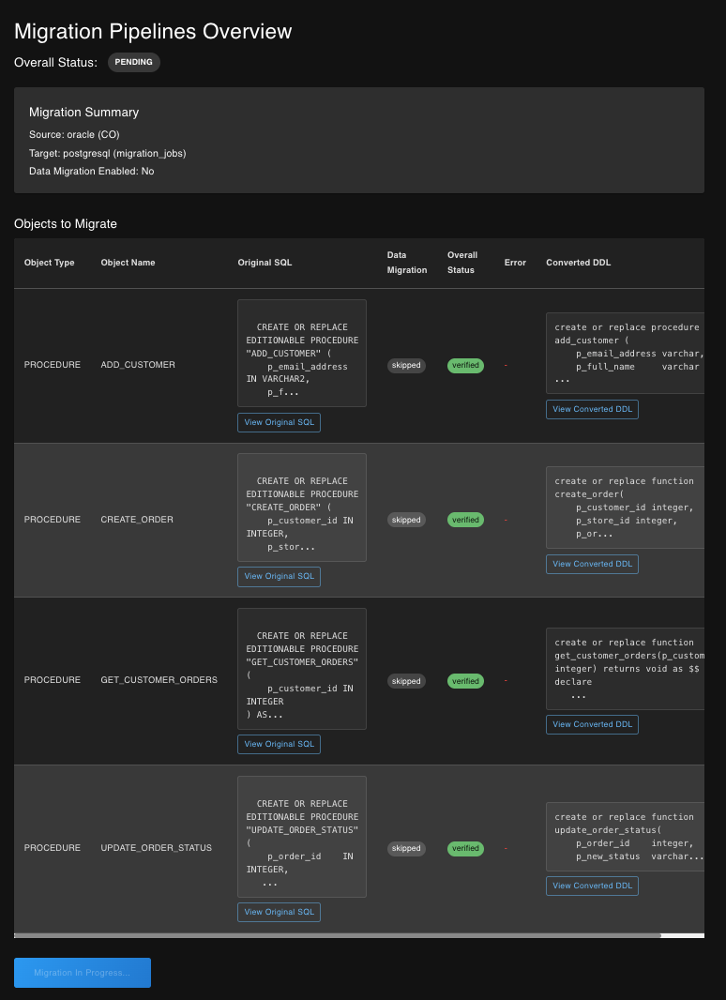

# DbMigrate.AI (An AI assistant for database migration)

**Note:**
This project is experimental and may not cover all edge cases in SQL conversion. Please review converted SQL before use in production environments.

Blog Post: [DbMigrate.AI - An AI-Powered Database Migration Assistant](https://site.arullab.com/posts/DBMIGRATEAI/)


 
## Overview

**DbMigrate.AI** is an Private AI-powered tool designed to facilitate the migration of databases from Oracle to PostgreSQL. It offers a comprehensive solution with a web-based user interface and a RESTful API to streamline the entire migration process.

The tool leverages a local Ollama Large Language Model (LLM) to automatically convert Oracle SQL syntax (including Stored Procedures, Functions, and Data Definition Languages - DDLs) to be compatible with PostgreSQL.

## Key Features

- **AI-Powered SQL Conversion:** Automatically converts Oracle SQL to PostgreSQL syntax.
- **Database Metadata Extraction:** Extracts schema information and DDLs from Oracle databases for various objects like Tables, Views, Procedures, etc.
- **SQL Execution:** Executes SQL scripts on the target PostgreSQL database.
- **Verification:** Verifies the converted SQL against the target PostgreSQL database to ensure compatibility and correctness.
- **llm autocorrect** failed jobs are retried with llm for syntax auto correction.
- **Web UI:** An intuitive Gradio-based web interface for:
    - Database connection management (Oracle and PostgreSQL).
    - Metadata extraction from Oracle.
    - SQL conversion (from text input or file upload).
    - SQL script execution on PostgreSQL.
    - Data migration management.
    - Real-time job status monitoring.
- **REST API:** A FastAPI-based API that allows for programmatic control over all migration functionalities.
- **Asynchronous by Design:** Utilizes RabbitMQ as a message broker to handle time-consuming tasks like SQL conversion and data migration asynchronously, ensuring the UI remains responsive.
- **Job Tracking:** Employs a PostgreSQL database to persist and track the status of all migration jobs.
- **MCP TOOLS:** Enable as MCP Server and MCP tools 
- **Tracing:** - Tracing for tracking job status, performance and errors. 

## Project Structure

The project is organized into several key components:

- **`app.py`:** The entry point for the Gradio web UI.
- **`worker.py`:** The core worker process that listens for tasks on the RabbitMQ queue and performs the conversion, verification, and migration operations.
- **`api/`:** The backend application built with FastAPI.
    - **`main.py`:** Defines the API endpoints.
    - **`ai_converter.py`:** Handles the SQL conversion logic using the Ollama model.
    - **`database.py`:** Manages the connection and operations with the job tracking database.
    - **`migration_db.py`:** Contains the logic for data migration.
    - **`oracle_helper.py`:** A set of utility functions for interacting with Oracle databases.
    - **`postgres_utils.py`:** A set of utility functions for interacting with PostgreSQL databases.
    - **`queues.py`:** Manages the RabbitMQ message queues.
    - **`schema_comparer.py`:** Compares the schemas of the source and target databases.
    - **`verification.py`:** Handles the verification of the converted SQL.
- **`frontend/`:** Contains a React-based frontend.
- **`ui/`:** Includes the callbacks and API client for the Gradio UI.
- **`verifier/`:** Contains the logic for the database migration verification process.
- **`sql-assets/`:** A collection of sample SQL files for testing purposes.
- **`docker/`:** Contains Dockerfiles and other Docker-related configuration.
- **`gini.sh`:** A utility script to set up and run the entire application stack.

## Architecture

The application follows a distributed architecture:

1.  The **Web UI** or an **API Client** initiates a migration job.
2.  The **API Server** (FastAPI) receives the request, creates a job in the database, and publishes a message to a **RabbitMQ** queue.
3.  One or more **Workers** consume the message from the queue.
4.  The worker performs the required task (e.g., SQL conversion using the **Ollama LLM**, data migration).
5.  The worker updates the job status in the database.
6.  The **Web UI** polls the API server to get the latest job status and displays it to the user.
  

**Target User:** Database administrators and developers who are migrating a database from Oracle to PostgreSQL.

**Motivation:** The motivation behind this project is to simplify the often complex and error-prone process of migrating databases between different SQL dialects, specifically from Oracle to PostgreSQL. By leveraging AI and automation, the tool aims to reduce manual effort and increase accuracy in the conversion process.

          
#### Future Improvements (WIP):
- Enhance SQL conversion accuracy with RAG/CAG. (current options:  sql verification, llm auto correction)
- Add support for more Oracle features. (in progress: supports ddl, sp, functions, tables, indexes, views, triggers, packages)
- Improve user interface and experience. (mvp in place)
- Implement authentication and security features. (not yet implemented)
- Add more robust error handling and logging. (basic in place: need to improve)
- Add support for more database systems. (Is it worth it?????)
- Containerize the application using Docker compose. (not yet implemented)
- Deploy the application to a kubernetes cluster. (not yet implemented)
- Add AI Query Optimizer for psql (not yet implemented)
- Guidance on Data Migration from Oracle to Postgres (This should be outsourced to ETL like tool: basic implementation in gradio py)

 
---

### Project WebUI Screnshots





<!-- ---

 -->

----

This project provides a web-based UI and an API to convert Oracle stored procedures, functions and DDL's to PostgreSQL PL/pgSQL syntax using a local Ollama model.

## Setup

1.  **Install Dependencies using uv:**

    This project uses `uv` for package management. If you don't have it installed, please follow the instructions here: [https://github.com/astral-sh/uv](https://github.com/astral-sh/uv)

    ```bash
    uv venv
    uv pip install -r requirements.txt
    ```

2.  **Ensure Ollama is running:**

    Make sure the Ollama application is running on your machine.

    **Note:** The model used for conversion is determined by the `OLLAMA_MODEL_NAME` environment variable. If this variable is not set, the application will attempt to detect the first running Ollama model. You can set `OLLAMA_MODEL_NAME` to specify a particular model (e.g., `llama2`, `codellama`, `gpt_oss`).

## Running the Application

1.  **Make sure the `gini.sh` script is executable:**

    ```bash
    sh gini.sh
    ```

2.  **Run the application:**

    ```bash
    sh run_app.sh
    ```

    This script will:
    *   Create a virtual environment.
    *   Install the dependencies.
    *   Start the API server in the background.
    *   Start the Gradio web UI in the foreground.

    The Gradio UI will be available at `http://127.0.0.1:7860`.

    To stop the application, simply press `Ctrl+C` in the terminal where you ran the script. This will stop both the web UI and the API server.

3.  **Run the react frontend:**

    ```bash
    cd frontend
    npm install
    npm start
    ```

## How to Use

### option 1: Migration workflow and MCP tools with Gradio.

1.  Open the Gradio UI in your browser [http://127.0.0.1:7860/?lang=mcp](http://127.0.0.1:7860/?lang=mcp)
2.  You can either paste your Oracle stored procedure into the text box or upload a file containing the stored procedure.
3.  Click the "Convert" button.
4.  The converted PostgreSQL stored procedure will be available for download.

### option 2: Automated workflow with React

1. Open front reach frontend at [http://localhost:3001/](http://localhost:3001/)

---

## Working with API's for bluk conversion

The API provides a way to convert Oracle SQL to PostgreSQL PSQL. It's a two-step process:

### 1. Upload SQL file for conversion

Send a POST request to the `/convert-file` endpoint with the SQL file you want to convert.

```bash
curl -X POST http://127.0.0.1:8000/convert-file -F "file=@oracle-sp-new.sql" --output converted.sql
```

The API will respond with a JSON object containing a `job_id`.

```json
{"job_id":"92a6b9dc-1403-44b4-b345-32bfcb5244da"}
```

### 2. Retrieve the conversion result

Use the `job_id` from the previous step to poll the `/job/{job_id}` endpoint.

```bash
curl http://127.0.0.1:8000/job/92a6b9dc-1403-44b4-b345-32bfcb5244da
```

The API will respond with a JSON object containing the status of the job. Once the job is complete, the response will include the original and converted SQL.

```json
{
  "job_id": "92a6b9dc-1403-44b4-b345-32bfcb5244da",
  "status": "verified",
  "original_sql": "...",
  "converted_sql": "...",
  "error_message": null
}
```

### 3. Aggregate Bulk Conversion Results

When you submit a file containing multiple stored procedures, the API returns a list of `job_ids`. To avoid polling each job individually, you can use the `/jobs/aggregate` endpoint to retrieve the results for all jobs in a single request.

**Request:**

Send a `POST` request to `/jobs/aggregate` with a JSON payload containing the list of `job_ids`.

```bash
curl -X POST http://127.0.0.1:8000/jobs/aggregate -H "Content-Type: application/json" -d '{"job_ids": ["24721911-2fc3-4413-8a37-86bc50a61d54", "7bdc286b-30c3-4903-a44d-78644cfa00b8", "f426dfd2-011d-44b5-bc3a-794ad33e5d35"]}'
```

**Response:**

If any of the jobs are still pending, the API will return a `202` status with a list of the pending job IDs.

```json
{
  "status": "processing",
  "pending_jobs": ["7bdc286b-30c3-4903-a44d-78644cfa00b8"],
  "total_jobs": 3
}
```

Once all jobs are complete, the API will return a `200` status with the aggregated results in one of two formats: `json` (default) or `sql`.

*   **JSON Response (`?format=json`)**

    The default JSON response separates the successful and failed conversions.

    ```json
    {
      "status": "completed",
      "successful_sql": "-- Converted SQL for job 24721911-2fc3-4413-8a37-86bc50a61d54...\n/\n-- Converted SQL for job f426dfd2-011d-44b5-bc3a-794ad33e5d35...",
      "failed_sql": ""
    }
    ```

*   **SQL Response (`?format=sql`)**

    You can request a single, combined SQL file by using the `format=sql` query parameter. This is ideal for saving all results to a single file.

    ```bash
    curl -X POST "http://127.0.0.1:8000/jobs/aggregate?format=sql" -H "Content-Type: application/json" -d '{"job_ids": ["..."]}' --output all_converted.sql
    ```

    The resulting `all_converted.sql` file will contain all the converted SQL, with comments indicating which jobs failed.

<!-- ## DDL Conversion 

This project now supports the conversion of Oracle DDL (Data Definition Language) to PostgreSQL DDL.

### API Usage for DDL

The process is similar to the stored procedure conversion.

#### 1. Submit a DDL conversion job

You can submit a DDL for conversion either as a raw string or by uploading a file.

**As a raw string:**

Send a POST request to the `/convert-ddl` endpoint with a JSON payload containing the DDL string.

```bash
curl -X POST http://127.0.0.1:8000/convert-ddl -H "Content-Type: application/json" -d '{"sql": "CREATE TABLE users (id NUMBER, name VARCHAR2(100));"}'
```

**By uploading a file:**

Send a POST request to the `/convert-ddl-file` endpoint with the DDL file.

```bash
curl -X POST http://127.0.0.1:8000/convert-ddl-file -F "file=@my_ddl.sql"
```

The API will respond with a `job_id`:

```json
{"job_id":"your-new-job-id"}
```

#### 2. Retrieve the conversion result

Poll the `/job/{job_id}` endpoint as before. The response will now include a `job_type` field, which will be `'ddl'` for these jobs.

```bash
curl http://127.0.0.1:8000/job/your-new-job-id
```

```json
{
  "job_id": "your-new-job-id",
  "status": "completed",
  "job_type": "ddl",
  "original_sql": "CREATE TABLE users (id NUMBER, name VARCHAR2(100));",
  "converted_sql": "CREATE TABLE users (id INTEGER, name VARCHAR(100));",
  "error_message": null
}
```

--- -->

<!-- <p align="center">

</p> -->


<!-- 


---


---


---


---


---

 -->

---

<!-- # Project Scripts

### `gini.sh`

This is the main script to set up and run the entire application. It automates the following steps:

1.  **Cleanup**: Removes artifacts from previous runs, such as `converted-*`, `failed-*`, `jobs.db`, and `successful-*` files.
2.  **Dependency Check**: Verifies that `uv`, `docker`, and `ollama` are installed.
3.  **Ollama Model Check**: Ensures that an Ollama model is running and accessible.
4.  **Python Environment Setup**: Creates a virtual environment (if it doesn't exist) and installs all required Python packages using `uv`.
5.  **Dockerized Services**:
    *   Starts a **RabbitMQ** container for messaging.
    *   Starts an **Oracle Database** container and initializes it with a user and grants.
    *   Starts a **PostgreSQL** container with `pgvector` for the verifier.
6.  **Environment Variables**: Exports the necessary database connection details for the application to use.
7.  **Application Launch**:
    *   Starts the FastAPI server (`api/main.py`).
    *   Starts the Celery worker (`worker.py`).
    *   Starts the Gradio web UI (`app.py`).

To run the script, make it executable and then run it:

```bash
chmod +x gini.sh
./gini.sh
``` -->
<!-- 
## Scripts and Modules

### `app.py`

This is the main entry point for the Gradio web UI. It creates the user interface, handles user interactions, and makes API calls to the backend for conversion tasks. It includes tabs for different functionalities like direct conversion, file upload, DDL conversion, and database connection.

### `api/main.py`

This script defines the FastAPI application and its endpoints. It handles HTTP requests for converting SQL, checking job status, and aggregating results. It uses RabbitMQ to queue conversion jobs.

### `api/database.py`

This module manages all interactions with the PostgreSQL database. It includes functions for creating the jobs table, creating and updating job records, and retrieving job information.

### `api/ai_converter.py`

This module handles the AI-powered SQL conversion and schema comparison. It contains functions like `convert_oracle_to_postgres` for converting Oracle SQL to PostgreSQL syntax and `compare_schemas_with_ollama_ai` for comparing Oracle and PostgreSQL DDLs using an Ollama model.

### `api/oracle_helper.py`

This module provides utilities for interacting with Oracle databases. It includes functions to establish connections, retrieve schema names, list database objects (tables, procedures, etc.), and extract DDL (Data Definition Language) for specified objects. It also supports fetching table data in batches.

### `api/execution_logic.py`

This module contains the core logic for processing SQL files and orchestrating the migration pipeline. It includes `process_sql_file` for sanitizing SQL and queuing execution jobs, and `initiate_migration_pipeline` for managing the end-to-end migration of selected Oracle objects to PostgreSQL.

### `api/models.py`

This file defines the Pydantic models used for data validation and serialization in the FastAPI application. It ensures that the data exchanged between the client and the server has the correct structure and types.

### `api/sanitizer.py`

This module provides a function to sanitize SQL code by removing comments and normalizing whitespace before it is sent to the language model for conversion.


 -->

## License

This project is licensed under the Apache License - see the [LICENSE](LICENSE) file for details.
