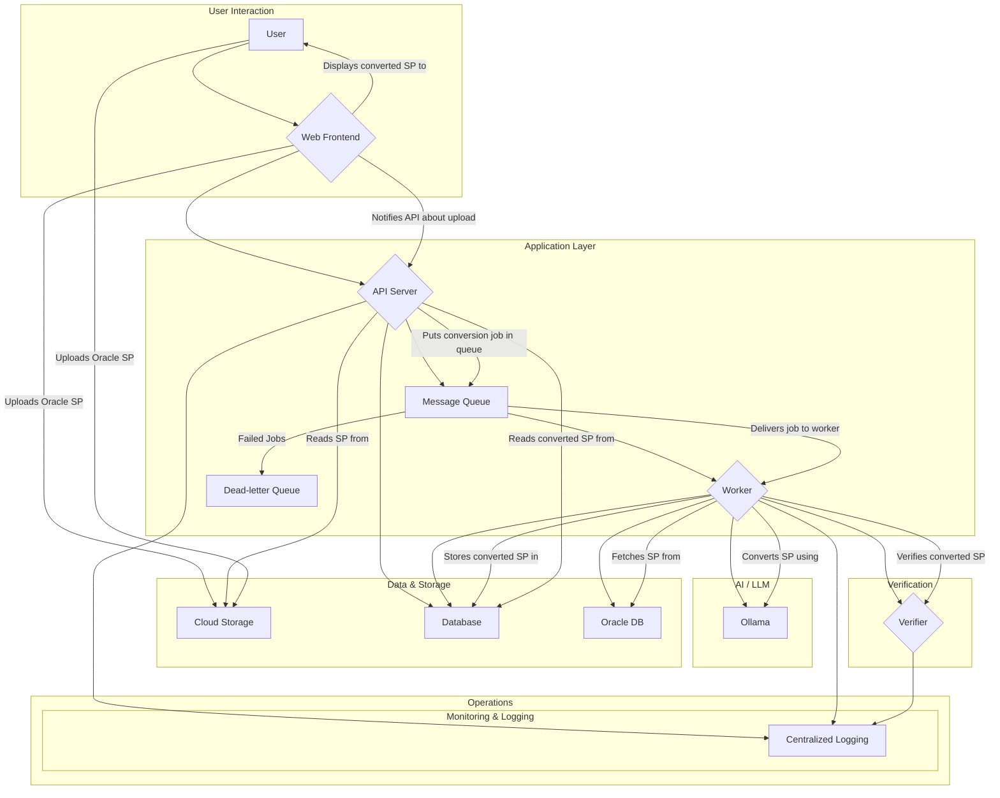

# SPF Converter Architecture

## Components

*   **Web Frontend (`app.py`):** A web interface for users to upload Oracle stored procedures directly to cloud storage.
*   **API Server (`api/`):** A backend API that receives notifications about file uploads, queues conversion jobs, and serves the converted procedures to the user.
*   **Message Queue (`rabbitmq.md`):** A message broker (like RabbitMQ) that manages the queue of conversion jobs.
*   **Worker (`worker.py`):** A background worker that picks up conversion jobs from the queue, performs the conversion from Oracle to PostgreSQL, and stores the result in the database.
*   **Ollama:** An AI model that assists the worker in converting Oracle stored procedures to PostgreSQL.
*   **Database (`database.md`):** A PostgreSQL database that stores the converted stored procedures.
*   **Oracle DB:** The source Oracle database from which the stored procedures are read.
*   **Verifier (`verifier/`):** A component to verify the correctness of the converted stored procedures. It may involve compiling the converted procedure in a temporary PostgreSQL database and running a set of predefined tests against it.
*   **Cloud Storage:** A service like AWS S3 or Google Cloud Storage for direct file uploads from the user's browser.
*   **Dead-letter Queue:** A queue to store messages from jobs that have failed to process, allowing for later inspection and debugging.
*   **Centralized Logging:** A system to aggregate logs from all components for monitoring and troubleshooting.

## Improvements

### Data Flow

To improve performance and scalability, especially with large files, the user will upload the Oracle SP file directly to a secure cloud storage bucket. The web frontend will then notify the API server with a reference to the uploaded file. This offloads the file transfer from the API server, freeing it up to handle more requests.

### Error Handling

A dead-letter queue (DLQ) is introduced. If a worker fails to process a conversion job after a certain number of retries, the message is moved to the DLQ. This prevents the message from being endlessly retried and allows developers to analyze the cause of the failure.

### Security

*   **Credential Management:** All secrets, such as database credentials and API keys, will be stored in a secure vault or secret management system, not in the codebase.
*   **Input Sanitization:** The API server will perform strict input sanitization on all incoming data to prevent common security vulnerabilities.

### Monitoring and Logging

All components will send logs to a centralized logging system. This allows for a unified view of the system's health and performance. Health check endpoints will be exposed by the API server and workers to allow for automated monitoring.

### Verification Process

The verifier component will be enhanced to perform a more robust verification of the converted stored procedure. This will include:
1.  Attempting to compile the converted procedure in a sandboxed PostgreSQL database.
2.  Running a suite of generic tests to check for common conversion errors.
3.  Optionally, allowing users to provide their own test cases for more specific verification.