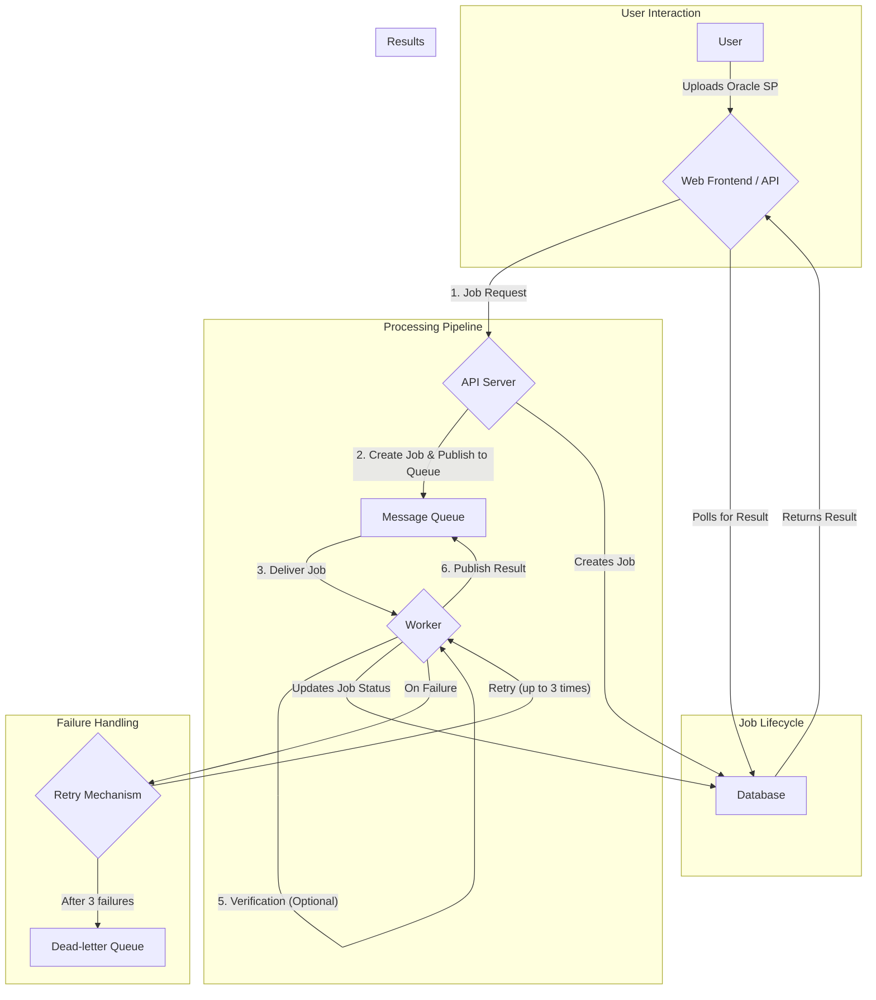

# Project Workflow

This document outlines the workflow of the SPF Converter project, from job submission to completion, including the failure and retry mechanisms.

## Workflow Diagram

## Workflow Steps

1.  **Job Submission**: A user submits an Oracle stored procedure for conversion through the web frontend or the API.
2.  **Job Creation and Queuing**: The API server receives the request, creates a new job record in the database with a `pending` status, and publishes a message containing the job details to the message queue (RabbitMQ).
3.  **Job Consumption**: A worker process, which is subscribed to the queue, picks up the job message.
4.  **Conversion**: The worker uses the Ollama model to convert the Oracle SQL to PostgreSQL syntax.
5.  **Verification (Optional)**: After conversion, the worker can optionally verify the generated PostgreSQL code by attempting to execute it against a PostgreSQL database.
6.  **Result Publishing**: The worker publishes the result of the conversion (either the converted SQL or an error message) back to the message queue.
7.  **Result Consumption and Job Update**: A result collector process consumes the result message and updates the corresponding job record in the database with the final status (`completed` or `failed`) and the result data.
8.  **Result Retrieval**: The user can poll the API with the job ID to check the status and retrieve the conversion result once the job is complete.

## Failure Handling and Retries

The system is designed to be resilient to transient failures during the conversion process.

*   **Retry Mechanism**: When a worker fails to process a job (e.g., due to a temporary network issue or a problem with the Ollama model), the job is not immediately marked as failed. Instead, it is automatically returned to the queue to be retried by another (or the same) worker.

*   **Retry Attempts**: A job is retried a maximum of **3 times**. This number is configurable in the worker's settings.

*   **Dead-letter Queue (DLQ)**: If a job fails for the 3rd time, it is considered a permanent failure. The message is then moved from the main queue to a **Dead-letter Queue (DLQ)**. This prevents the failing job from blocking the processing of other jobs and allows developers to investigate the cause of the failure by inspecting the messages in the DLQ.
