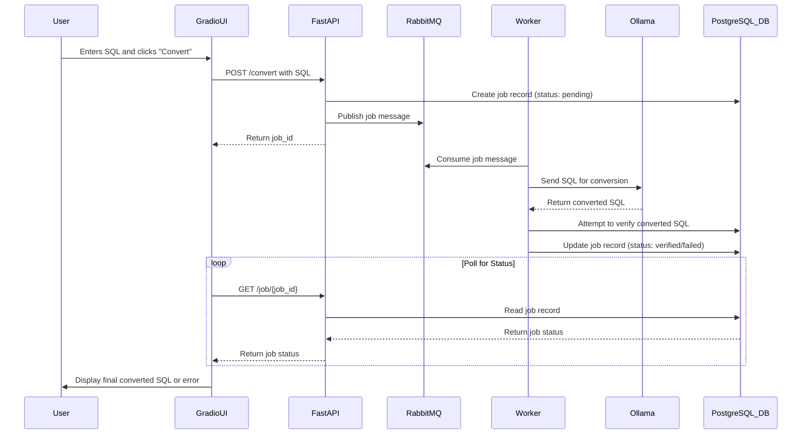

# Project Structure and Workflow

This document provides an overview of the project structure, the role of each component, and the typical data flow for a conversion task.

## Directory Structure

The project is organized into several key directories, each with a specific responsibility.

```
/Users/avannala/Documents/workspace/spf-converter/
├─── api/                    # The FastAPI backend application
│    ├─── routes/            # API endpoint definitions (routers)
│    │    ├─── conversion_routes.py
│    │    ├─── execution_routes.py
│    │    ├─── job_routes.py
│    │    ├─── migration_routes.py
│    │    └─── oracle_routes.py
│    ├─── ai_converter.py     # Handles interaction with the Ollama AI model
│    ├─── database.py         # Manages all database connections and queries
│    ├─── execution_logic.py  # Business logic for the SQL executor feature
│    ├─── main.py             # Main FastAPI application entry point
│    ├─── models.py           # Pydantic models for API data validation
│    ├─── oracle_helper.py    # Helper functions for Oracle DB interaction
│    ├─── queues.py           # RabbitMQ queue configuration and connection
│    └─── startup.py          # Logic to run on application startup (e.g., init DB)
├─── ui/                     # Frontend-specific modules
│    └─── api_client.py       # Client for the Gradio UI to communicate with the backend API
├─── app.py                  # The main entry point for the Gradio web UI
├─── worker.py               # The background worker for processing async tasks
├─── gini.sh                 # Script to initialize and run the entire application
├─── requirements.txt        # Python dependencies
├─── project-structure.md    # This file
└─── ... (other assets, docs, etc.)
```

### Key Files and Scripts

*   **`app.py`**: This is the main entry point for the Gradio web interface. It defines all the UI components (tabs, buttons, text boxes) and their corresponding event handlers. It uses the `ui/api_client.py` to communicate with the backend.

*   **`api/main.py`**: The main entry point for the FastAPI backend. It creates the FastAPI application instance and includes all the modular routers from the `api/routes/` directory.

*   **`worker.py`**: A standalone Python script that acts as a background worker. It connects to RabbitMQ, listens for jobs on different queues (e.g., `conversion_jobs`, `sql_execution_jobs`), and performs the heavy lifting like calling the AI model or executing SQL scripts.

*   **`gini.sh`**: A shell script that acts as the primary runner for the project. It performs the following steps:
    1.  Checks for dependencies (like `docker`, `ollama`).
    2.  Sets up the Python virtual environment.
    3.  Starts required services using Docker (PostgreSQL, RabbitMQ, Oracle).
    4.  Starts the FastAPI backend server.
    5.  Starts the Gradio UI.

## Architecture Diagram

This diagram illustrates the high-level architecture of the system, showing how the different components interact.

```mermaid
architecture-beta
    group ui(desktop)[User Interface]
        service browser(browser)[Browser] in ui
        service gradio(server)[Gradio UI] in ui

    group app(cloud)[Application]
        service fastapi(server)[FastAPI Backend] in app
        service worker(server)[Python Worker] in app

    group services(cloud)[Services]
        service rabbitmq(queue)[RabbitMQ] in services
        service postgres(database)[PostgreSQL] in services
        service oracle(database)[Oracle DB] in services
        service ollama(robot)[Ollama AI] in services

    browser:R -- L:gradio
    gradio:R -- L:fastapi
    fastapi:R -- L:rabbitmq
    fastapi:R -- L:postgres
    worker:R -- L:rabbitmq
    worker:R -- L:postgres
    worker:R -- L:oracle
    worker:R -- L:ollama
```



## Workflow Diagram: Stored Procedure Conversion

This diagram details the step-by-step process of converting a stored procedure.


